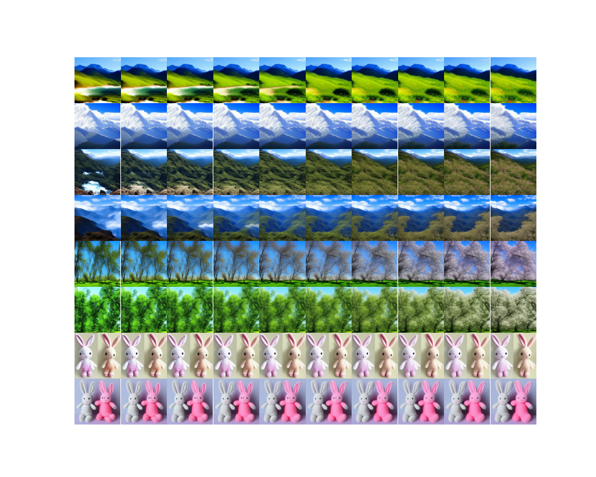

# Prompt-to-Video
Official implementation of Prompt-to-Video.


## Installation
For install and running this repo:

1. Install required packages:
```
python3 -m pip install requirements.txt
```

2. Run bash file:
 ```
bash install.sh
```

### Paper
See at [Paper](https://colab.research.google.com/drive/1eIVgC8H8Ftmv0AliiLAv0U_GQgRugi28) for full report.

### Results
For generate video, use *Tprompt_to_video.py* with relevant arguments:
	[x] prompt (required)
	[x] exp_header (required): Name of experiment, results will be saved in folder with this name.
	[x] dest_words (optional): You can specify word(s) to be sweeped. If skiped, our algorithm will detect them.
	[x] num_kf (default: 4): number of keyframes.
	[x] attn_value_min/max (default: -0.5/0.5): range of weights for dest words.
	
For example:
 ```
python3 --prompt blooming_mountains --exp_header blooming --num_kf 10
```
More than 130 videos were generated and stored under [Results](https://github.com/00itamarts00/SweepedDescriptors/tree/main/results) folder.